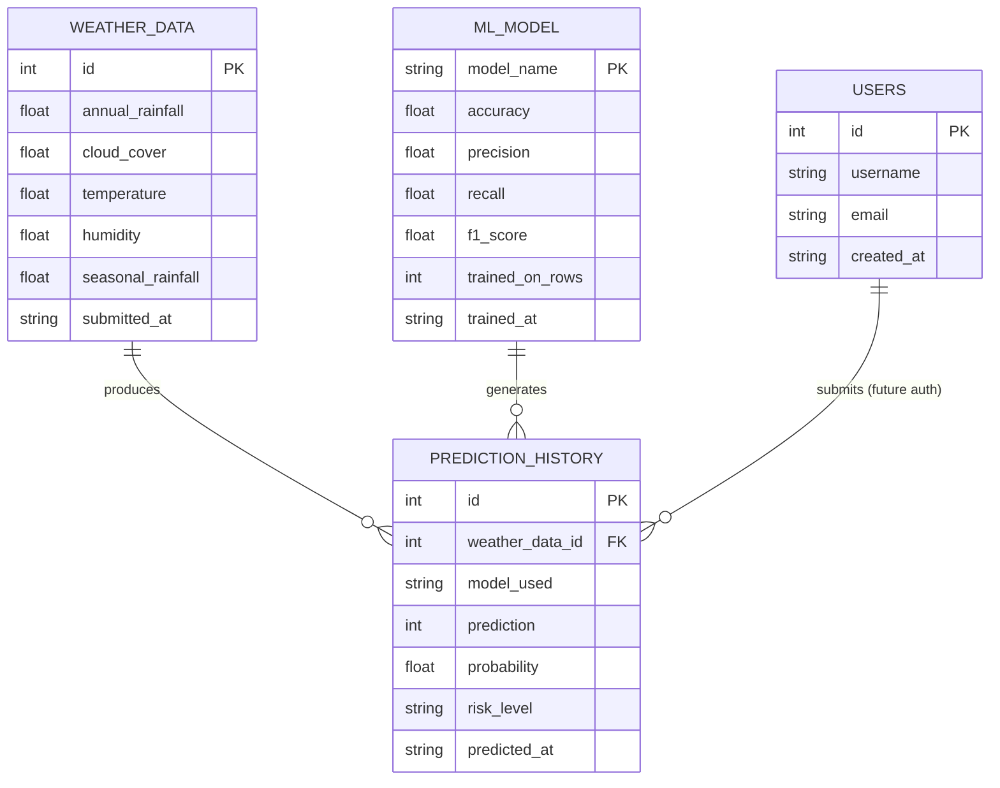

# Entity-Relationship Diagram

This is the ER diagram for the AquaGuard SQLite schema (see `database.py`).
GitHub, GitLab and most Markdown viewers render Mermaid diagrams natively -
open this file in the repo to see it rendered, or paste the block into
https://mermaid.live for a standalone view.

### Notes on the schema

- `weather_data` stores exactly what a visitor typed into the Predict form -
  nothing is derived or scaled before it's persisted, so the raw input
  history stays reproducible.
- `prediction_history` is foreign-keyed to `weather_data` rather than
  duplicating the reading, keeping one row per prediction cycle.
- `ML_MODEL` isn't a physical SQLite table in the current build (it's
  represented by `models/model_metadata.json` instead) but is included
  here because the assignment brief calls for it as a conceptual entity -
  promoting it to a real table is a one-migration change if multiple
  model versions ever need to be tracked side by side.
- `users` exists as a placeholder for a future login flow; no route
  currently writes to it.
